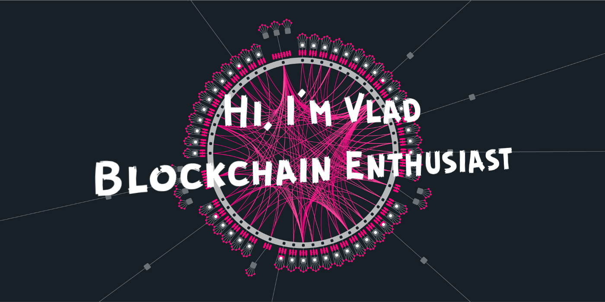

<p align="center"></p>

<br/>

**About me**
- 💼 Data Engineer at Samsung R&D
- 🌐 Blockchain maximalist
- 📚 Currently focusing on learning Rust :gear:

<br/>

<!--START_SECTION:waka-->
📊 **This Week I Spent My Time On** 

```text
💬 Programming Languages: 
Rust                     7 hrs 6 mins        ███████████████████░░░░░░   75.64% 
Brainfuck                1 hr 34 mins        ████░░░░░░░░░░░░░░░░░░░░░   16.74% 
Markdown                 34 mins             █░░░░░░░░░░░░░░░░░░░░░░░░   6.17% 
YAML                     7 mins              ░░░░░░░░░░░░░░░░░░░░░░░░░   1.3% 
BrightScript             0 secs              ░░░░░░░░░░░░░░░░░░░░░░░░░   0.09%

```


<!--END_SECTION:waka-->


| <a href="https://github.com/anuraghazra/github-readme-stats"></a> | <a href="https://github.com/anuraghazra/github-readme-stats"></a> |
| ------------- | ------------- |
